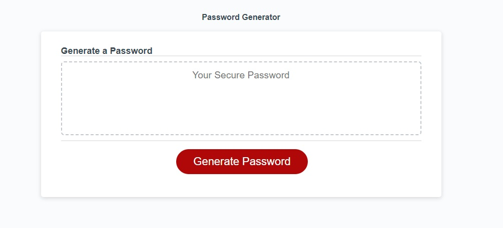

<a name="readme-top"></a>

# Password-Generator by Huber Heats

## Description

This website provides an Password Generator application that generates a random password based on the users selection.

The user can select:
* Password length (8-128 characters long)
* Complexity of password, whether the password contains:
    * Lower case letters
    * Upper case letters
    * Numbers
    * Special characters

The application has data validation built in to help guide the user to provide required parameters to generate a password
Once parameters are defined, the password generator will produce the output within the webpage for the user to use.

Note: this password generator has been updated from baseline code that was provided to me

The password generator was developed with the below user story and acceptance criteria.

## User Story

```
AS AN employee with access to sensitive data
I WANT to randomly generate a password that meets certain criteria
SO THAT I can create a strong password that provides greater security
```
<p align="right">(<a href="#readme-top">back to top</a>)</p>

## Acceptance Criteria

```
GIVEN I need a new, secure password

WHEN I click the button to generate a password
THEN I am presented with a series of prompts for password criteria

WHEN prompted for password criteria
THEN I select which criteria to include in the password

WHEN prompted for the length of the password
THEN I choose a length of at least 8 characters and no more than 128 characters

WHEN asked for character types to include in the password
THEN I confirm whether or not to include lowercase, uppercase, numeric, and/or special characters

WHEN I answer each prompt
THEN my input should be validated and at least one character type should be selected

WHEN all prompts are answered
THEN a password is generated that matches the selected criteria

WHEN the password is generated
THEN the password is either displayed in an alert or written to the page

```
<p align="right">(<a href="#readme-top">back to top</a>)</p>

## Screenshot

The following are screenshots of the web application's appearance




<p align="right">(<a href="#readme-top">back to top</a>)</p>

## Installation

Cloning the repo is the only step required.

<p align="right">(<a href="#readme-top">back to top</a>)</p>


## Usage

Link to deployed website is found here:
* https://hybee234.github.io/Password-Generator/
  
index.html and style.css files can be opened in Visual Studio Code

<p align="right">(<a href="#readme-top">back to top</a>)</p>
 

## Credits
Othneildrew - for the example on linking back to the top of the readme page!

<p align="right">(<a href="#readme-top">back to top</a>)</p>

## License

Please refer to the LICENSE in the repo.
<p align="right">(<a href="#readme-top">back to top</a>)</p>

## Badges

N/A
<p align="right">(<a href="#readme-top">back to top</a>)</p>

## Features

Particular effort was invested into meaningful:
* Console logging
* Commentary in the script.js file

I hope this makes for easier review for anyone taking a closer look

<p align="right">(<a href="#readme-top">back to top</a>)</p>

## How to Contribute

N/A
<p align="right">(<a href="#readme-top">back to top</a>)</p>

## Tests

### Application specific:
* Validate that clicking the Generate Password button begins the process of password generation
* Validate that the Password Length prompt has validation checking in place to guide th user to enter the correct value for password length
    * Value must be a number
    * Value must be an integer
    * Password length is limited to 8-128 characters
* Validate that the Password Generator will prompt the user for at least one character type (lower case, upper case, number, special characters) if the user cancels all options
* Validate that the user is presented with the parameters chosen after selecting them all
* Validate that a password is generated within the parameters selected (Password Length, characters used)
* Validate that logs are being capture appropriately within Console Log

### Developer practice tests:
* Validate that the application deployed at the live URL (https://hybee234.github.io/Password-Generator/)
* Validate that the webpage loaded without errors
* Validate that GitHub URL has been submitted
* Validate that GitHub repository contains application code
* Validate that the application resembles mock-up provided in the challenge instructions
* Validate that the GitHub repository has a unique name
* Validate that the GitHub repostiory followed be practice for class/id naming conventions, indentation, quality comments, etc
* Validate that the repository contains multiple descriptive commit messages
* Validate that the repository contains a quality README file with description, screenshot and link to deployed applications
<p align="right">(<a href="#readme-top">back to top</a>)</p>
